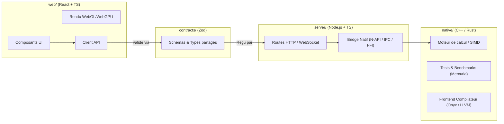

# Carte d'Architecture & Décisions Techniques (ADR)

Ce document décrit l'organisation globale du système et les choix techniques fondamentaux.

---

## 1. Vue d'Ensemble des Flux

Le projet est conçu selon un modèle en oignon (Clean Architecture) où les données et calculs transitent par des frontières strictes :

---

## 2. Rôles des Répertoires

| Répertoire | Rôle principal | Dépendances autorisées |
|---|---|---|
| `contracts/` | Source unique de vérité pour les types et schémas partagés. | Zod uniquement. |
| `web/` | Interface graphique et visualisations scientifiques. | `contracts/`, bibliothèques web (React, Vitest). |
| `server/` | API backend, orchestration des jobs, pont natif. | `contracts/`, `native/` (via binaire ou bindings). |
| `native/` | Calcul haute performance, algorithmes scientifiques, compilateurs. | STL C++, Crates Rust, LLVM (indépendant du web). |
| `.harness/` | Base de connaissances, méta-règles, playbooks pour l'agent. | Aucun code d'exécution. |
| `scripts/` | Outillage d'automatisation, build et vérification globale. | Bash, Docker, Make. |

---

## 3. Décisions Architecturales Majeures (ADR)

### ADR-001 : Découplage strict entre Interface et Moteur Natif
- **Contexte :** Le code C++ et Rust ne doit jamais être pollué par des dépendances au framework web.
- **Décision :** La couche `native/` expose une API pure (C ABI ou headers C++ documentés) ou un binaire exécutable testable de manière 100% autonome. La couche `server/src/bridge/` est la seule entité autorisée à interagir avec le moteur natif.

### ADR-002 : Validation obligatoire aux frontières par Zod
- **Contexte :** Dans un système distribué ou polyglotte, les dérives de typage entraînent des bugs silencieux en production.
- **Décision :** Tout payload envoyé ou reçu par l'API doit être validé via un schéma `z.object(...)` dans `contracts/schemas.ts`. Le type TypeScript correspondant est dérivé automatiquement via `z.infer<typeof ...>`.

### ADR-003 : Tolérance zéro aux régressions mémoire et de performance
- **Contexte :** Les applications scientifiques et les langages de programmation ne peuvent tolérer de fuites ou de ralentissements silencieux.
- **Décision :** Chaque commit exécutera `scripts/verify.sh` sous AddressSanitizer et mesurera la stabilité des benchmarks clés.
