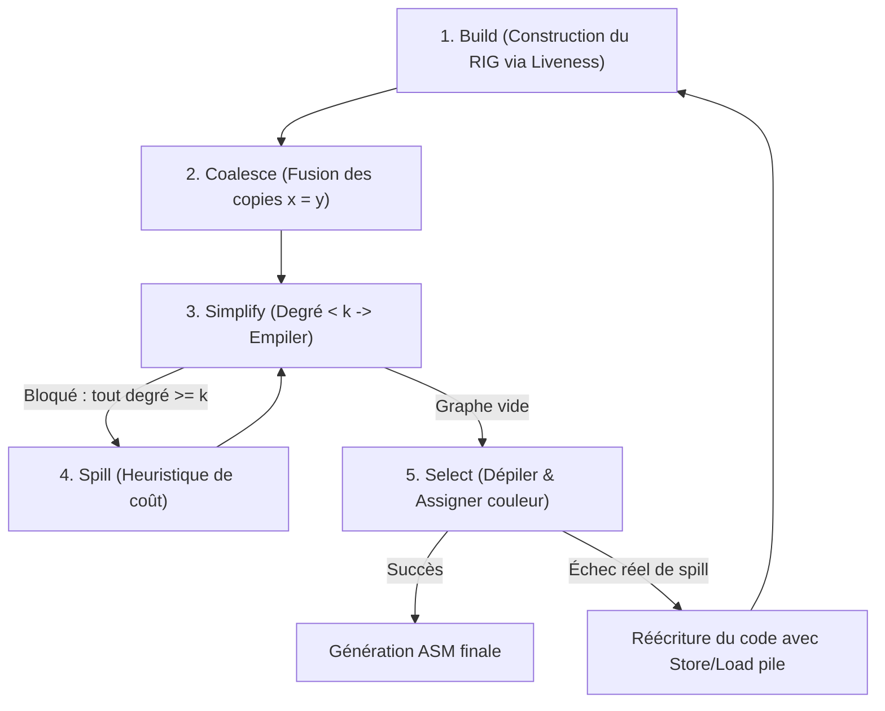

# 08. Allocation de Registres & Coloration de Graphe

> Synthèse algorithmique issue du Dragon Book (Chapitre 8, §8.8 : *Register Allocation and Assignment*). Du graphe d'interférence à l'algorithme de Chaitin-Briggs et au Linear Scan pour les runtimes JIT.

---

## 1. Le Problème de l'Allocation de Registres

Assigner une infinité de registres symboliques (temporaires de l'IR) à un ensemble fini de $k$ registres matériels (ex: 16 registres généraux sous x86-64 ou 32 sous ARM64/RISC-V) en minimisant les lectures/écritures sur la pile (*spills*).

---

## 2. Le Graphe d'Interférence de Registres (RIG)

Un graphe non orienté $G = (V, E)$ où :
- Chaque sommet $v \in V$ représente une variable ou un temporaire symbolique.
- Une arête $(u, v) \in E$ relie deux variables si et seulement si **leurs intervalles de vie se chevauchent** (calculés via l'analyse de variables vivantes - *Liveness Analysis*).

> **Théorème de Réduction :** Assigner $k$ registres physiques sans conflit équivaut strictement à résoudre le problème du **$k$-coloriage de graphe** (problème NP-complet).

---

## 3. L'Algorithme de Chaitin-Briggs

Cet algorithme heuristique résout le $k$-coloriage de manière quasi-optimale en temps quasi-linéaire en pratique.

### Les 5 Phases Détaillées :

1. **Build :** Calculer la vivacité des variables et tracer une arête entre toute paire de variables simultanément vivantes.
2. **Coalesce :** Pour une instruction de copie $x = y$, si $x$ et $y$ n'interfèrent pas et satisfont le critère de George ou Briggs (leur fusion ne crée pas un nœud de degré $\ge k$), fusionner $x$ et $y$ en un seul sommet et éliminer l'instruction de copie.
3. **Simplify (Heuristique de Kempe) :**
   - Tant qu'il existe un nœud $n$ avec $\text{degré}(n) < k$ :
     - Retirer $n$ et ses arêtes du graphe.
     - Empiler $n$ sur la pile de coloriage.
   - *Justification mathématique :* Si le sous-graphe sans $n$ est $k$-colorable, alors $n$ possède au maximum $k-1$ voisins colorés. Il restera donc obligatoirement au moins une couleur libre pour $n$.
4. **Spill (Débordement Heuristique) :**
   - Si tous les nœuds restants ont un degré $\ge k$, sélectionner un candidat $v$ maximisant le ratio :
     $$\text{Score}(v) = \frac{\text{Fréquence d'utilisation}}{\text{degré}(v)}$$
   - Pousser $v$ sur la pile comme « spill potentiel » et retirer $v$ du graphe.
5. **Select (Coloriage Optimiste de Briggs) :**
   - Dépiler chaque nœud un à un, le réinsérer dans le graphe et lui assigner la première couleur libre non utilisée par ses voisins immédiats.
   - Même un nœud marqué en « spill » peut souvent être coloré si ses voisins n'ont pas saturé toutes les $k$ couleurs (*Optimistic Coloring*).

---

## 4. Alternative pour Compilateurs JIT : Le Linear Scan

Pour un compilateur JIT haute vitesse (V8 JavaScript, LuaJIT, PyPy) où le temps de compilation doit être inférieur à la milliseconde :
- **Principe :** On trie les intervalles de vie de chaque variable par ordre de point de départ temporel croissant.
- On parcourt linéairement la liste :
  - Libérer les registres physiques des variables dont l'intervalle est terminé.
  - Assigner un registre libre à la nouvelle variable.
  - Si aucun registre n'est libre, déborder (*spill*) la variable dont la fin de l'intervalle est la plus lointaine.
- **Complexité :** $O(|V| \log |V|)$ contre $O(|V|^2)$ pour la coloration de graphe.
