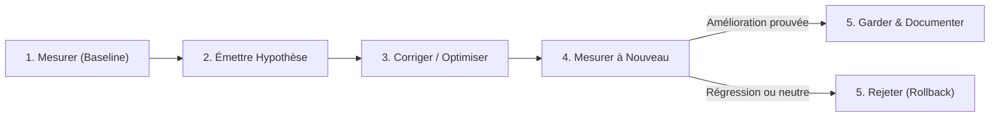

# Domaine Fullstack : Optimisation des Performances Applicatives

> Méthodologie empirique de mesure, indicateurs clés (Core Web Vitals, p99, Event Loop Delay), hiérarchie des gains d'optimisation et optimisation de la frontière Web↔Serveur.

---

## 1. La Boucle d'Optimisation Empirique

Toute optimisation de performance doit suivre la boucle fermée à 5 étapes :

> **Règle absolue :** Ne jamais se fier à l'intuition. Si le benchmark ou le profilage ne montre aucun gain mesurable au niveau p95/p99, le commit est rejeté.

---

## 2. Indicateurs Clés de Performance (KPIs)

### A. Côté Frontend (Core Web Vitals) :
- **LCP (Largest Contentful Paint) :** $\le 2.5\text{ s}$ (chargement du contenu principal).
- **INP (Interaction to Next Paint) :** $\le 200\text{ ms}$ (réactivité aux clics/entrées utilisateur).
- **CLS (Cumulative Layout Shift) :** $\le 0.1$ (stabilité visuelle sans sauts d'éléments).

### B. Côté Backend (Node.js / Express) :
- **Latence p99 :** $\le 50\text{ ms}$ sur les routes d'API critiques sous charge nominale.
- **Event Loop Delay :** $\le 10\text{ ms}$ au 99ᵉ percentile, mesuré via `perf_hooks.monitorEventLoopDelay({ resolution: 20 })`.

---

## 3. Hiérarchie des Gains d'Optimisation

Ne pas perdre de temps sur des micro-optimisations prématurées : s'attaquer aux goulots d'étranglement dans l'ordre décroissant d'impact :

| Étage | Ordre d'Impact | Goulot Principal & Remède |
|---|---|---|
| **1. Entrées/Sorties (I/O)** | $10\times$ à $1000\times$ | Élimination des requêtes $N+1$ (DataLoaders), indexation stricte des bases de données, pools de connexions persistants. |
| **2. Sérialisation & Frontière** | $2\times$ à $10\times$ | Remplacer les sérialisations JSON monolithiques géantes par du streaming (SSE, NDJSON), valider avec des schémas précompilés. |
| **3. Taille du Bundle Frontend** | $2\times$ à $5\times$ | Découpage dynamique du code (`React.lazy()`, dynamic `import()`), tree-shaking effectif, compression Brotli/Gzip sur CDN. |
| **4. Rendu & Cycle React** | $1.5\times$ à $3\times$ | Éliminer les re-renders inutiles (`memo`, hooks purs, dérivation sans état synchronisé), virtualisation des listes massives (`TanStack Virtual`). |
| **5. Micro-calculs CPU** | $1.1\times$ à $1.5\times$ | Optimisations algorithmiques scalaires (seulement si le profileur V8 CPU l'identifie comme hot spot). |

---

## 4. Optimisation de la Frontière Web $\leftrightarrow$ Serveur

1. **Compression Négociée :** Activer systématiquement la compression **Brotli** (`br`) en priorité, puis Gzip pour les payloads JSON et les assets statiques.
2. **Gestion de Cache HTTP Déterministe :**
   - Assets immuables (`/assets/*.hash.js`) : `Cache-Control: public, max-age=31536000, immutable`.
   - Données API dynamiques : Utiliser les en-têtes `ETag` et `If-None-Match` pour retourner un code `304 Not Modified` ultra-rapide lorsque les données n'ont pas changé.
3. **Flux de Données Massifs (Zéro-Copie) :**
   - Pour les graphiques et tenseurs scientifiques : ne pas convertir de grands tableaux de flottants en JSON textuel. Transmettre des buffers binaires natifs (`ArrayBuffer`, `Float64Array`) via WebSocket ou fetch direct de binaire brut.

---

## 5. Les 6 Anti-Patterns Formellement Interdits

1. ❌ **Blocage de l'Event Loop Node.js :** Appel synchrone (`fs.readFileSync`, calcul lourd de hachage sans worker thread ou cœur natif).
2. ❌ **Cache Mémoire Sans Limite :** Utilisation d'un objet global `{}` ou d'une `Map` sans politique d'éviction LRU ni TTL (fuite mémoire assurée).
3. ❌ **Cascades Réseau (*Waterfall Requests*) :** Le client effectue une requête A, attend, puis fait la requête B, puis C. Exiger l'agrégation ou le parallélisme via `Promise.all()`.
4. ❌ **Polling Agressif :** Interroger une route en boucle toutes les 500 ms au lieu d'utiliser Server-Sent Events (SSE) ou WebSocket.
5. ❌ **Bundle Frontend Monolithique :** Charger l'intégralité des routes, graphiques lourds et éditeurs dans le bundle JavaScript initial au premier chargement.
6. ❌ **Optimisation Prématurée à l'Aveugle :** Réécrire du code lisible sous prétexte de « micro-performance » sans trace de profilage l'ayant identifié comme goulot.

---

## 6. Checklist de Contrôle pour l'Agent

- [ ] L'optimisation proposée est-elle étayée par une mesure de latence ou un profil mémoire chiffré ?
- [ ] L'Event Loop Node.js est-elle exempte de tout calcul bloquant supérieur à 10 ms ?
- [ ] Les listes de données volumineuses côté client sont-elles paginées ou virtualisées ?
- [ ] Les payloads binaires volumineux évitent-ils la sérialisation en chaînes JSON ?
