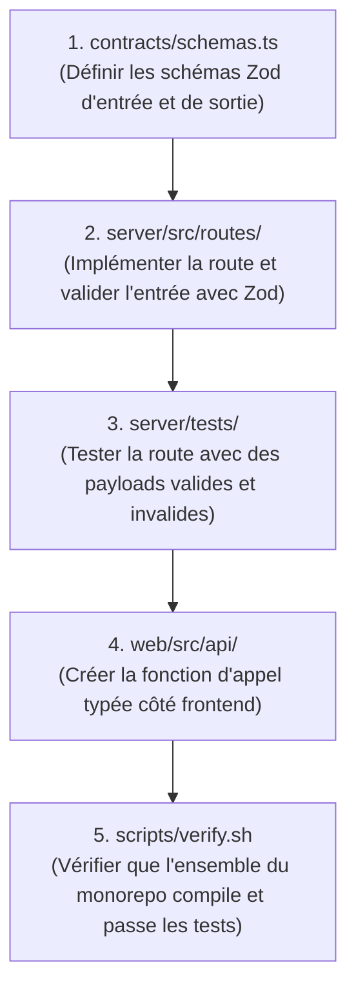

# Playbook : Ajouter un Endpoint Fullstack (Contracts -> Server -> Web)

Ce playbook décrit la séquence ordonnée pour ajouter une nouvelle fonctionnalité communicante entre le backend et le frontend.

---

## Ordre des Opérations



---

## 1. Mettre à jour `contracts/schemas.ts`
Ne commencez **jamais** par le serveur ou le client. Commencez par le contrat :
```typescript
import { z } from 'zod';

export const MonCalculRequestSchema = z.object({
  matrixSize: z.number().int().positive().max(10000),
  iterations: z.number().int().positive().default(100),
});

export const MonCalculResponseSchema = z.object({
  elapsedMs: z.number(),
  resultChecksum: z.string(),
});

export type MonCalculRequest = z.infer<typeof MonCalculRequestSchema>;
export type MonCalculResponse = z.infer<typeof MonCalculResponseSchema>;
```

## 2. Implémenter la route dans `server/`
Valider la requête avec le schéma Zod. Si invalide, retourner un code 400 clair.
Déléguer ensuite l'opération au bridge natif si nécessaire.

## 3. Écrire le test d'intégration backend
Tester le cas nominal (succès) et les cas d'erreur (paramètre hors bornes).

## 4. Consommer dans `web/src/api/`
Importer les types et schémas depuis `contracts/` pour assurer le typage statique immédiat.

## 5. Exécuter le juge
```bash
bash scripts/verify.sh
```
