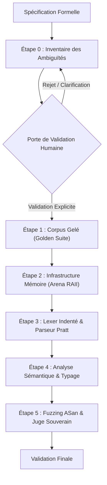

# Playbook : Implémentation d'un Nouveau Langage depuis une Spécification

Ce playbook définit le protocole industriel strict pour concevoir, implémenter et valider un nouveau langage de programmation (compilateur, parseur, runtime système) à partir d'une spécification formelle (ex: `.harness/knowledge/domain/DOCUMENTATIONS.md`).

---

## 1. Les Quatre Piliers Obligatoires

Toute implémentation de langage menée par un agent d'IA doit reposer sur les quatre piliers suivants sans dérogation possible :

### Pilier 1 : La Porte de Validation Humaine (Human-in-the-Loop Gate)
- **Principe d'immutabilité sémantique :** L'agent d'IA n'est jamais autorisé à modifier unilatéralement la sémantique, la syntaxe ou les invariants de la spécification.
- **Points d'arrêt obligatoires :** Dès qu'un cas limite, une ambiguïté grammaticale ou un conflit d'associativité est détecté, l'agent doit formuler une proposition d'arbitrage claire et **attendre la validation humaine explicite** avant d'écrire la grammaire ou de modifier l'AST.
- **Garantie d'alignement :** Aucune décision de conception majeure n'est prise sans inscription datée dans `.harness/knowledge/decisions.md`.

### Pilier 2 : Le Corpus Gelé (Frozen Reference Corpus)
- **Suite d'or immuable (*Golden Test Suite*) :** Un ensemble de snippets représentatifs issus directement de la spécification est figé dès le départ.
- **Règle de non-régression absolue :** Une fois qu'un snippet du corpus gelé compile et s'exécute correctement, il est interdit de modifier ses assertions de test. Toute modification ultérieure du compilateur doit préserver l'intégralité du corpus au vert.
- **Traçabilité des versions :** Tout changement de la spécification entraîne un nouveau numéro de version du corpus de référence.

### Pilier 3 : Le Fuzzing (Fuzz Testing Syntaxique & Mémoire sous ASan/UBsan)
- **Fuzzing Lexer/Parser (*Crash-free guarantee*) :** Le parseur et le lexer doivent être soumis à des campagnes de fuzzing intensives avec entrées corrompues (indentations négatives ou incohérentes, blocs non fermés, opérateurs consécutifs, caractères inattendus). Le compilateur doit retourner des erreurs propres sans jamais déclencher de `segfault`, d'avortement inopiné ou de boucle infinie.
- **Audit Sanitizers (ASan + UBsan) :** Tout programme, qu'il soit syntaxiquement valide ou rejeté avec une erreur, doit s'exécuter avec **0 fuite mémoire** et **0 comportement indéfini**. L'allocateur d'arène doit garantir la libération complète des ressources lors d'une erreur d'analyse.
- **Intégration au Juge :** La campagne de fuzzing est une étape bloquante intégrée dans `scripts/verify.sh`.

### Pilier 4 : L'Aller-Retour (Round-Trip Verification)
- **Boucle fermée de cohérence :**
  $$\text{Code Source} \xrightarrow{\text{Parse}} \text{AST} \xrightarrow{\text{Pretty-Print}} \text{Code Source}' \xrightarrow{\text{Re-Parse}} \text{AST}' \quad (\text{AST} \equiv \text{AST}')$$
- **Vérification d'idempotence :** Tout arbre de syntaxe abstrait doit pouvoir être réémis et réanalysé en conservant exactement la même structure et les mêmes types.
- **Confrontation Runtime :** L'évaluation de l'AST doit être systématiquement confrontée aux exemples numériques de la spécification.

---

## 2. Procédure d'Implémentation Pas-à-Pas (Protocole Général)

### Étape 0 : Inventaire des Ambiguïtés et Porte de Validation Humaine (OBLIGATOIRE)
1. **Audit critique de la spécification :**
   - Parcourir l'ensemble du document formel avant d'écrire la moindre ligne de code ou de grammaire formelle.
   - Relever systématiquement les zones d'ombre :
     - Conflits d'associativité et de précédence des opérateurs (ex: puissances successives, unaires préfixes vs infixes).
     - Ambiguïtés syntaxiques (ex: blocs indentés vs expressions multilignes, séparateurs de fin d'instruction).
     - Règles de promotion numérique ou conversions implicites vs coercition stricte.
     - Gestion du cycle de vie des valeurs et sémantique mémoire (ownership, linear/affine typing, RAII vs GC).
2. **Soumission du rapport d'arbitrage :**
   - Rédiger un tableau comparatif listant chaque ambiguïté, les options possibles et la recommandation argumentée.
3. **Point d'arrêt bloquant :**
   - **ATTENDRE la validation humaine formelle** avant d'élaborer la grammaire formelle ou d'entamer l'implémentation.

### Étape 1 : Ingestion et Gel de la Spécification
1. Déposer la spécification formelle dans `.harness/knowledge/domain/`.
2. Extraire la table des opérateurs, priorités de liaison (binding powers) et associativités validées à l'Étape 0.
3. Rédiger les snippets du corpus de référence initial dans une suite de tests unitaires immuable.

### Étape 2 : Infrastructure Mémoire Déterministe
1. Concevoir l'allocateur d'arène contigu (`Arena`) sans Garbage Collector.
2. Implémenter le suivi déterministe des destructeurs non-triviaux pour garantir 0 fuite sous AddressSanitizer lors des succès comme des erreurs.

### Étape 3 : Lexer Indenté & Parseur Pratt
1. Implémenter la pile d'indentation (`INDENT` / `DEDENT` / `NEWLINE`) et le filtre d'espaces blancs.
2. Écrire le parseur d'expressions selon l'algorithme de Pratt (Niveaux de priorité stricts, associativité droite/gauche conforme à l'arbitrage).
3. Écrire le parseur d'instructions (blocs, déclarations, assignations, structures de contrôle, retours).

### Étape 4 : Vérification Statique & Typage Sémantique
1. Construire l'analyseur de durée de vie et de système de types (ex: typage linéaire/affine, détection de non-initialisation, résolution de surcharges).
2. Détecter et rejeter à la compilation toute violation d'invariant (ex: réutilisation après consommation, incompatibilité de type).

### Étape 5 : Banc de Fuzzing et Juge Souverain
1. Développer un fuzzer dédié (ex: `fuzz_<langage>.cpp`) générant des flux aléatoires et cas limites adversariaux.
2. Vérifier l'immunité aux plantages (`crash-free`) et l'absence de fuites sous AddressSanitizer et UndefinedBehaviorSanitizer.
3. Intégrer la cible dans `native/Makefile` et `scripts/verify.sh`.
4. Présenter le rapport de conformité pour franchir la **Porte de Validation Humaine** finale.

---

## 3. Étude de Cas Concrète : Le Langage Onyx

Cette section illustre l'application intégrale du protocole sur le langage système **Onyx** documenté dans [`.harness/knowledge/domain/DOCUMENTATIONS.md`](../domain/DOCUMENTATIONS.md).

### A. Application de l'Étape 0 sur Onyx
Avant d'écrire la grammaire d'Onyx, les ambiguïtés suivantes ont été relevées et arbitrées :
1. **Associativité de la puissance (`^`) :** La spécification mentionne `2 ^ 3 ^ 2`. Décision humaine validée : associativité à droite stricte ($2^{3^2} = 2^9 = 512$).
2. **Commentaires imbriqués :** Délimiteurs `(< ... >)` pouvant être multilignes ou imbriqués sans interférer avec les opérateurs de comparaison `<` ou `>`.
3. **Promotion numérique :** Tour d'élargissement numérique stricte : $\text{int} \to \text{real} \to \text{complex} \to \text{quaternion}$. Vérification : `2 == 2.0` s'évalue à `true`.
4. **Typage linéaire et persistance :**
   - Variable linéaire consommée lors de sa première transmission à droite.
   - Modificateur `!i` pour forcer la persistance.
   - Primitive intrinsèque `copy(x)` pour duplication explicite.

### B. Moteur et Vérification dans la Forge
- **Sources :** Implémenté en C++20 sous [`examples/onyx/`](../../examples/onyx/) :
  - [`arena.hpp`](../../examples/onyx/arena.hpp) : Allocateur contigu zéro-GC avec chaîne de nettoyage RAII.
  - [`lexer.hpp`](../../examples/onyx/lexer.hpp) / [`lexer.cpp`](../../examples/onyx/lexer.cpp) : Gestion de la pile d'indentation et des commentaires `(< ... >)`.
  - [`parser.hpp`](../../examples/onyx/parser.hpp) / [`parser.cpp`](../../examples/onyx/parser.cpp) : Parseur Pratt 10 niveaux.
  - [`linear_check.hpp`](../../examples/onyx/linear_check.hpp) : Vérificateur de consommation linéaire compile-time.
  - [`runtime.hpp`](../../examples/onyx/runtime.hpp) : Évaluateur arithmétique pour scalaires, complexes et quaternions.
- **Suite d'or gelée :** [`examples/test_onyx.cpp`](../../examples/test_onyx.cpp) validant les 8 cas nominaux de la spécification.
- **Banc de Fuzzing :** [`examples/onyx/fuzz_onyx.cpp`](../../examples/onyx/fuzz_onyx.cpp) (5000 itérations adversariales sous ASan/UBsan avec 0 fuite et 0 crash).
- **Intégration Juge :** Étape 2 de [`scripts/verify.sh`](../../scripts/verify.sh).
