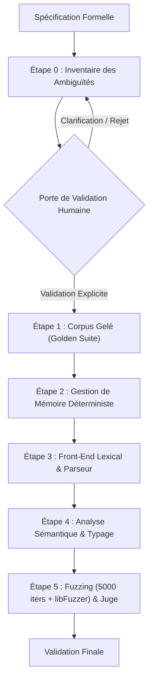

# Playbook : Implémentation d'un Nouveau Langage depuis une Spécification

Ce playbook définit le protocole industriel strict pour concevoir, implémenter et valider un nouveau langage de programmation (compilateur, parseur, runtime système) à partir d'une spécification formelle.

---

## 1. Les Quatre Piliers Obligatoires

Toute implémentation de langage menée par un agent d'IA doit reposer sur les quatre piliers suivants sans dérogation possible :

### Pilier 1 : La Porte de Validation Humaine (Human-in-the-Loop Gate)
- **Principe d'immutabilité sémantique :** L'agent d'IA n'est jamais autorisé à modifier unilatéralement la sémantique, la syntaxe ou les invariants de la spécification.
- **Points d'arrêt obligatoires :** Dès qu'un cas limite, une ambiguïté grammaticale ou un conflit d'associativité est détecté, l'agent doit formuler une proposition d'arbitrage claire et **attendre la validation humaine explicite** avant d'élaborer la grammaire formelle ou de modifier l'AST.
- **Garantie d'alignement :** Aucune décision de conception majeure n'est prise sans inscription datée dans `.harness/knowledge/decisions.md`.

### Pilier 2 : Le Corpus Gelé (Frozen Reference Corpus)
- **Suite d'or immuable (*Golden Test Suite*) :** Un ensemble de snippets représentatifs issus directement de la spécification est figé dès le départ.
- **Règle de non-régression absolue :** Une fois qu'un snippet du corpus gelé compile et s'exécute correctement, il est interdit de modifier ses assertions de test. Toute modification ultérieure du compilateur doit préserver l'intégralité du corpus au vert.
- **Traçabilité des versions :** Tout changement de la spécification entraîne un nouveau numéro de version du corpus de référence.

### Pilier 3 : Le Fuzzing (Double Fuzzing : Sanity Minimal & Couverture LLVM)
- **Seuil minimal aléatoire (5000 itérations) :** Le parseur et le lexer doivent être soumis à une campagne de robustesse minimale de **5000 itérations aléatoires** (injection de bruit, tokens adversariaux, désynchronisations d'indentation) pour certifier l'absence d'avortement sauvage.
- **Fuzzing guidé par la couverture (LLVM libFuzzer) :** Pour une assurance industrielle complète, le compilateur doit intégrer un harnais libFuzzer (`-fsanitize=fuzzer,address,undefined`) instrumentant la couverture de branches, transitions de graphe de contrôle et exploration d'arbres syntaxiques profonds.
- **Audit Sanitizers (ASan + UBsan) :** Tout programme soumis au fuzzer, qu'il soit syntaxiquement valide ou rejeté avec une erreur, doit s'exécuter avec **0 fuite mémoire** et **0 comportement indéfini**.
- **Intégration au Juge :** Dans le projet du langage, la campagne de fuzzing constitue une étape bloquante intégrée au script `scripts/verify.sh`.

### Pilier 4 : L'Aller-Retour (Round-Trip Verification)
- **Boucle fermée de cohérence :**
  $$\text{Code Source} \xrightarrow{\text{Parse}} \text{AST} \xrightarrow{\text{Pretty-Print}} \text{Code Source}' \xrightarrow{\text{Re-Parse}} \text{AST}' \quad (\text{AST} \equiv \text{AST}')$$
- **Vérification d'idempotence :** Tout arbre de syntaxe abstrait doit pouvoir être réémis et réanalysé en conservant exactement la même structure et les mêmes types.
- **Confrontation Runtime :** L'évaluation de l'AST doit être systématiquement confrontée aux sorties numériques ou logiques de référence.

---

## 2. Procédure d'Implémentation Pas-à-Pas (Protocole Universel)

### Étape 0 : Inventaire des Ambiguïtés et Porte de Validation Humaine (OBLIGATOIRE)
1. **Audit critique de la spécification :**
   - Parcourir l'intégralité de la spécification avant d'écrire la moindre ligne de code, de grammaire ou de lexer.
   - Identifier systématiquement les zones d'ambiguïté :
     - Conflits d'associativité et de priorité des opérateurs.
     - Ambiguïtés de délimitation ou de fin d'instruction.
     - Règles de coercition implicite vs typage nominal/structurel strict.
     - Modèle de cycle de vie des valeurs et gestion de mémoire.
2. **Soumission du rapport d'arbitrage :**
   - Rédiger un tableau comparatif listant chaque ambiguïté, les options possibles et la recommandation argumentée.
3. **Point d'arrêt bloquant :**
   - **ATTENDRE la validation humaine formelle** avant d'élaborer la grammaire formelle ou d'entamer l'implémentation.

### Étape 1 : Ingestion et Gel de la Spécification
1. Déposer la spécification formelle dans `.harness/knowledge/domain/`.
2. Extraire la table des opérateurs, priorités de liaison et associativités validées à l'Étape 0.
3. Figer la suite d'or initiale (*Golden Test Suite*) dans les tests unitaires.

### Étape 2 : Gestion de Mémoire Déterministe
1. Établir le modèle mémoire du runtime (arène contiguë, comptage de références déterministe ou ownership linéaire selon la nature du langage).
2. Garantir la destruction RAII et l'absence totale de fuites sous AddressSanitizer lors des rejets syntaxiques comme des succès d'exécution.

### Étape 3 : Front-End Lexical & Parseur
1. Développer l'analyseur lexical (filtrage d'espaces, gestion des délimiteurs et commentaires).
2. Implémenter le parseur d'expressions (algorithme de Pratt ou descente récursive avec binding powers) et le parseur d'instructions.
3. Garantir la résistance aux erreurs : le front-end doit intercepter toute syntaxe mal formée et lever des exceptions typées sans jamais crasher.

### Étape 4 : Analyse Sémantique & Invariants de Typage
1. Implémenter la vérification statique des règles du langage (résolution de types, vérification de portée, durées de vie, immutabilité).
2. Détecter et rejeter à la compilation toute violation d'invariant définie dans la spécification.

### Étape 5 : Campagnes de Fuzzing & Juge Souverain
1. Brancher la cible sur un générateur d'échantillons aléatoires et adversariaux.
2. Exécuter un **seuil minimal de 5000 itérations aléatoires** sous ASan/UBsan pour certifier la robustesse initiale.
3. Fournir le point d'entrée pour **LLVM libFuzzer** (`-fsanitize=fuzzer,address,undefined`) pour l'exploration par couverture de code.
4. Intégrer la cible dans le Makefile et dans le juge `scripts/verify.sh` du projet.

---

## 3. Déploiement Externe via le Forge Hub

Tout nouveau langage conçu à partir d'une spécification est développé **en dehors du dépôt central de la Forge**, dans un environnement autonome initialisé via le Hub :

1. **Scaffolding du projet :** Utiliser l'outil MCP `forge_scaffold_harness` avec le type `cpp` ou `rust`.
2. **Consultation des modèles canoniques :** Interroger `forge_get_canonical_example` pour instancier :
   - Le parseur Pratt avec arène mémoire : [`canonical_pratt_parser_arena.cpp`](../examples/canonical_pratt_parser_arena.cpp).
   - Le lexer vectoriel et tokenisation Pratt : [`canonical_lexer_pratt.rs`](../examples/canonical_lexer_pratt.rs).
   - L'allocateur d'arène C23 : [`canonical_arena_c23.c`](../examples/canonical_arena_c23.c).
3. **Théorie des compilateurs :** Utiliser `forge_query_knowledge` (requêtes Dragon Book, SSA, automates, régie mémoire sans GC).
4. **Vérification autonome :** Chaque projet externe possède son propre juge `scripts/verify.sh` assurant le verdict PASS sans fuite.
